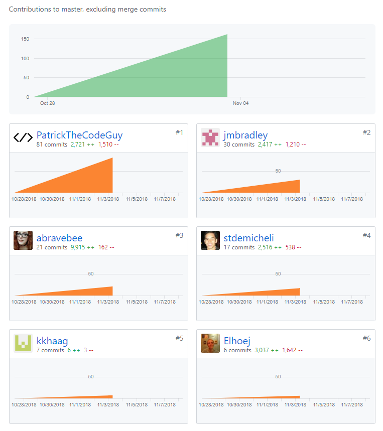

Github Handle: PatrickTheCodeGuy

Follow me!

## This is my first blog post during Lambda Labs.

During this week, my team and I set out to make sure that we were all on the same page on our first day. It consisted of us making sure that we used the same packages, same linter as well as the same idea of where we wanted to start. It was great that we did because it helped push our project forward very well. The other issue we sorted out quickly was figuring out where we wanted to start. Because we were working in tandem with iOS developers on our team, they needed data to display ASAP so they can get their iOS version of our app going as soon as possible, so we started on the back end. I used an UML diagram to create a rough idea of how we wanted to structure our SQL databases so that we can easily create our backend faster. [UML Diagram](./umlDiagram.png)

Once we established a visual to follow, my team memeber Joseph and I set out to structure the database using our migrations from Knex.js. This took us about a day and half of strong work and sweaty brows but we pulled through and got it going while our third team mate, Casey, was designing our front end with Ligma. Once we confirmed that our API routes worked and we seeded our database with dummy data, I started looking into getting this database deployed using Heroku. I ran into a couple problems, mostly with discovering how Heroku Postgres reads our migrations and how they restrict the foriegn keys from them. This caused us some headache, but with a bit of a long night, research, and persistence, we finally pulled through and got our database and API deployed Wednesday night.

## Tasks Pulled

### Front End

- Ticket 1
  -- initial creation of the front end and deployment
  https://github.com/Lambda-School-Labs/Labs8-MealHelper/pull/4

  https://trello.com/c/9z6NUrMX/11-frontend.

- Ticket 2
  -- Boilerplating for Redux actions and reducers
  https://github.com/Lambda-School-Labs/Labs8-MealHelper/pull/11

https://trello.com/c/9z6NUrMX/11-frontend

- Ticket 3
  -- Creation of user reducers and actions!
  https://github.com/Lambda-School-Labs/Labs8-MealHelper/pull/2

https://trello.com/c/tqV8JPoS/1-create-user-accounts

### Back End

- Ticket 1
  -- Creation of the database and our first iteration of API endpoints!
  https://github.com/Lambda-School-Labs/Labs8-MealHelper/pull/3

  https://trello.com/c/NID77aAp/9-database

- Ticket 2
  -- The finishing of our API endpoints!

  https://github.com/Lambda-School-Labs/Labs8-MealHelper/pull/14

  https://trello.com/c/HYPI6t1d/34-api-routes

- Ticket 3
  -- The bug fixing that allowed our database to be fully deployed!
  https://github.com/Lambda-School-Labs/Labs8-MealHelper/pull/21

  https://trello.com/c/qE0np4cb/36-deployed-to-the-web-back-end

## A Hard-look at Ticket 3

This ticket was the most satisfying to pull in. This is where we finally were able to get that backend fully connected to the Heroku Postgres correctly, as well as made sure that the API endpoints were hitting correctly. [Data from Heroku](./data.png)

This point was extremely hard for us because for some reason our seed data was returning error of foreign key constraints, and we could not figure out where in the code we were going wrong. It seemed like everything we did, every article fix we read, got us no closer to fixing the problem then when we started. [Heroku log](./postgres/png)

Finally we discovered the issue was because with postgres, we have to explicitly state what our ids are by defining them in our method brackets, as well as making them our primary keys as well. By doing this, this allowed postgres to go through the migrations properly and let us set our seed data properly. [Knex Code](./knexcode.png)

Now we look ahead to the front end and any other problems we may need to encounter. I hope you guys will follow the journey ahead with em next week!
