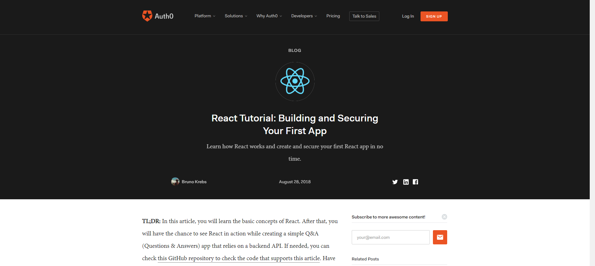

Github Handle: PatrickTheCodeGuy

Follow me!

## This is my second blog post during Lambda Labs.

Welcome back! During this second week, the team and I set out with a couple of goals in mind (thank you lambda mvp), route our front end to our deployed back end, get authentication in (with auth0 as part of it) as well as get two third party API's working and displaying data. The team met up and we designated out the tasks to everyone. Casey (an amazing human being by the way) and I focused our attention on auth0 and getting that routed up to our backend, while Joseph and Haywood focused on getting the home page up as well as displaying two API endpoints.

During auth0, Casey and I struggled a bit with understanding all the moving parts. It didn't help that Auth0's documentation and tutorial automatically assumed some knowledge of how _they_ would set up their files, leaving the readers with a gap in understanding. Thankfully our Project Manager Keith came in with the slam dunk, and provided us with a link to a tutorial that explained everything in perfect detail. He gave us a basic slate on our project, and it opened our understanding to Auth0 (Thank you Keith, honestly man you are the best) in a way that the Auth0 documentaion could not.
Then Thursday the team and I circled up and Joseph and Haywood completed their tasks and got the OpenWeathers API displaying and fetching, as well as getting the USDA API displaying info as well. Over all this week has been a bit of a rollercoaster, and I'm sure we will very much enjoy our Thanksgiving break next week. See you guys in two weeks!

## Tasks Pulled

### Front End

- Ticket 1
  -- Creation of the sign up/sign in page with redux.
  https://github.com/Lambda-School-Labs/Labs8-MealHelper/pull/36

  https://trello.com/c/tqV8JPoS/1-create-user-accounts.

- Ticket 2
  -- Creation of Auth0 Login/Sign Up buttons with redux
  https://github.com/Lambda-School-Labs/Labs8-MealHelper/pull/42

https://trello.com/c/IWV6m9XM/43-sign-up-page

### Back End

- Ticket 1
  -- Changes to how the recipes/ ingredients foreign keys work.
  https://github.com/Lambda-School-Labs/Labs8-MealHelper/pull/32

  https://trello.com/c/NID77aAp/9-database

- Ticket 2
  -- Changing of the back end to allow for passwordless accounts for Auth0

  https://github.com/Lambda-School-Labs/Labs8-MealHelper/pull/41

  https://trello.com/c/tqV8JPoS/1-create-user-accounts

## A Hard-look at Ticket 2

This ticket is where we finally got Auth0 to work. It was mostly infuriating because we needed the ID token back so that we can grab either an email or a name from it to store for our users, but it kept coming back null. We ended up taking a 10 minute break to clear our heads and come back to it

When we came back from our break, we found a second tutorial that explained a little more about what we are trying to do, except it added Auth0Lock, which for the most part, added more confusion rather than solve the issues we had in the first place.

Finally thanks to Keith our PM, we were able to get an amazing tutorial that solved all of our issues, he even went as far as to templete it, then apply it to our already existing code. With a few modifications, I ended up finishing out the redux portion to add them to our database, and voila! We hit our goal for the week!

We have a week off next week for Thanksgiving break, I look forward to my next blog post after that! Happy Thanksgiving everyone!
