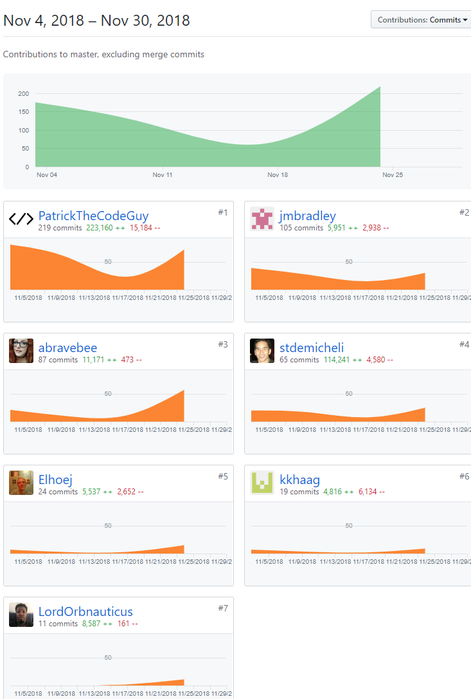
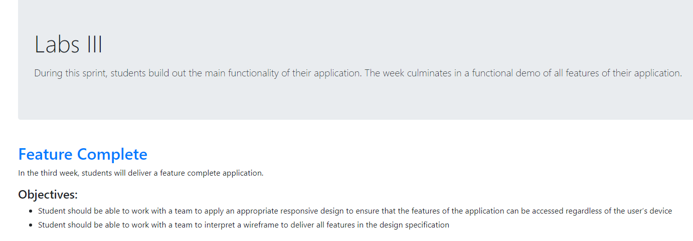
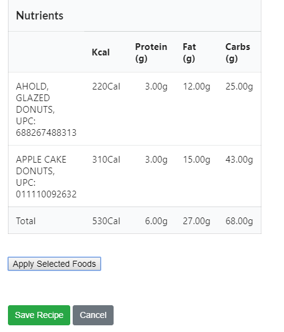
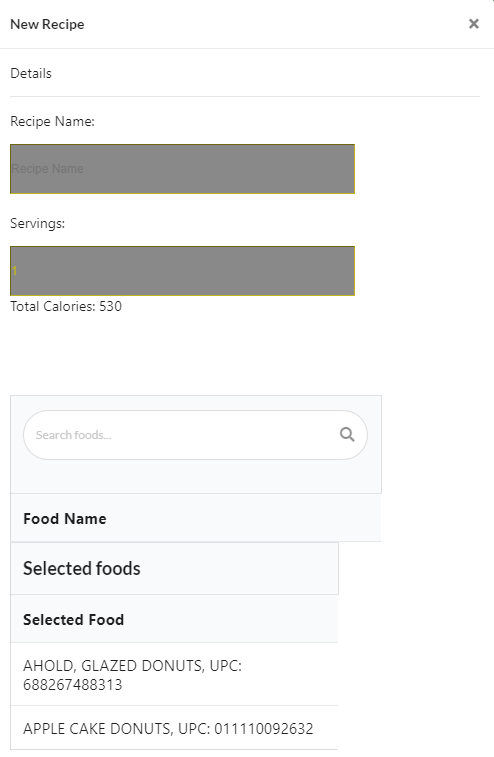
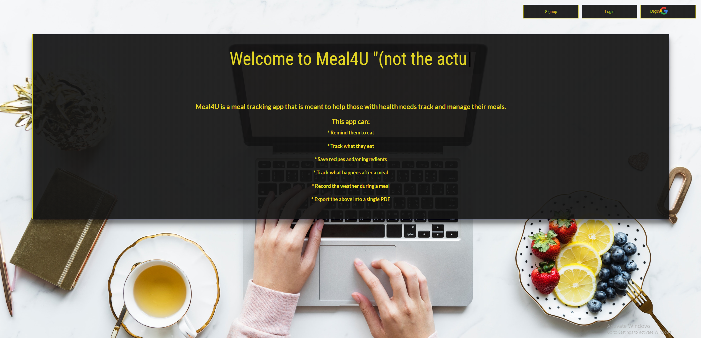

Github Handle: PatrickTheCodeGuy

Follow me!

## This is my third blog post during Lambda Labs.

Welcome back again everyone! Week 3 was such an emotional experience for me, as I'm sure it has been for the team as well. We came in monday with only maybe two features working fully, and still had 7 or 8 features that needed to be done. The goals for week 3 were to be feature complete, as well as to incorporate respoonsive design into our labs project so that it was mobile friendly. Yes, you read that right, FEATURE COMPLETE by Friday. We were on the ropes and we knew it. Over the course of the four days we had, we stayed up late, averaged about 4 hours of sleep a night and pushed through to feature completedness by Friday! I have been so impressed with the team this week. We all really came together and got things done that needed to be fixed.

The biggest challenge that we faced was getting nutrients, ingredients and recipes all working cohesively together. Each one relied on the other and if one wasnt perfect the other would fail. Getting that right was the biggest chunk of our week, totalling 2 days of almost 50 hours of hands on keyboard coding. We ran into a lot of issues from async issues, to posting issues, to multiple refactors of our back end tables (which in itself needed migrations and rollbacks). Another interesting contention was the fact that meals was easy because all it needed was a recipe ID to work. I thought that meals would be the biggest pain to deal with because it has the most rows in its table (totalling well over 8 or 9 rows), but we actually got that done first.

## Tasks Pulled

### Front End

- Ticket 1
  -- Temporary fix to logging in and not getting pushed to the home page plus a log out button.
  https://github.com/Lambda-School-Labs/Labs8-MealHelper/pull/84

  https://trello.com/c/oFotzRx5/46-landing-page-navigation

- Ticket 2
  -- Adds loading animations and a total refactor of our login page, sign up page, and landing page.
  https://github.com/Lambda-School-Labs/Labs8-MealHelper/pull/105

https://trello.com/c/IWV6m9XM/43-sign-up-page

### Back End

- Ticket 1
  -- Creation and routing of ingredients and nutrients tables.
  https://github.com/Lambda-School-Labs/Labs8-MealHelper/pull/82

  https://trello.com/c/jnEV1pRQ/18-lookup-add-ingredient

- Ticket 2
  -- Adds the last touches need to ingredients for recipes to be posted.

  https://github.com/Lambda-School-Labs/Labs8-MealHelper/pull/94

  https://trello.com/c/CmIwWFVR/10-backend

## A Hard-look at Ticket 1 on the Back End

Ticket 1 was the bread and butter, as well as the make it or break it for this week. This one took us the most work in terms of completion. This ticket added the interweaving of the ingredients and nutrients table. The idea was that every ingredient had multiple nutrients to it, otherwise known as a one to many relationship. The Nutrients table held a foreign key reference to the ingredients, so it could associate multiple nutrients to one ingredient. We had to refactor our back end MULTIPLE times to get this to work. Note to self for the future, dont rush ahead and think you know how everything should be set up on the get go.

Ticket 2 on the back end is when everything really started to come together. With that pull request we finally had ingredients and nutrients working together under a recipe. This wasnt as hard as the recipe only needed an array of ingredient ids to associate to and since we fixed the "multiple ids" with regards to our ingredients needing multiple nutrients ids, we easily applied the same logic to our recipes modals.

Lastly on ticket 2 for our front end, we wrapped up our front end a little, refactored our sign up, sign in and added a landing page per design spec requirements. This wasnt so bad because visually our front end had all the components we needed, we just had to fix around our css.

Last but not least, I did a new whiteboarding question with one of my old PM's before I moved into the Labs portion of Lambda School. You guys can see my butt get kicked [here!](https://youtu.be/4vkR6B2uOrY)

We have a week off next week for Thanksgiving break, I look forward to my next blog post after that! Happy Thanksgiving everyone!
